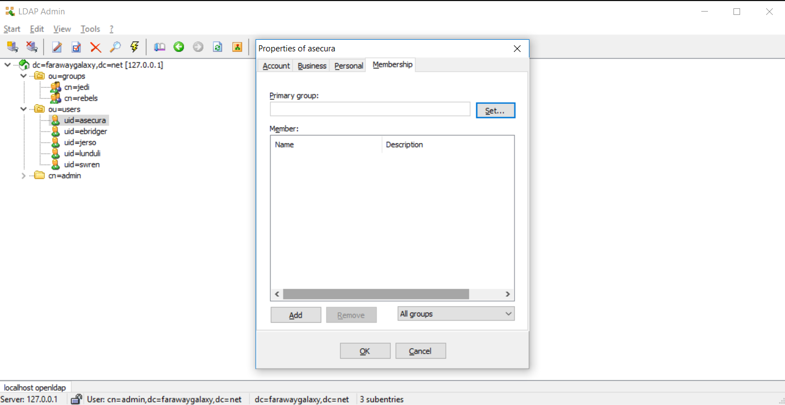
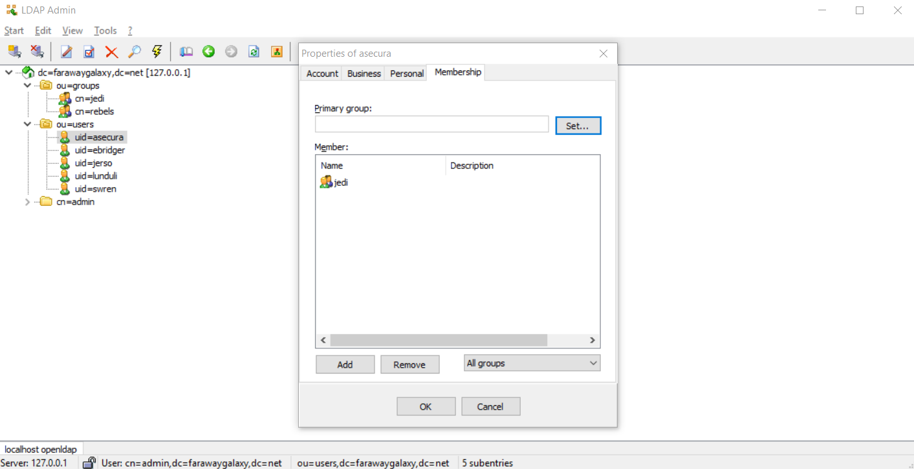

# OpenLDAP demo container

Quick and dirty OpenLDAP Docker container for demo purposes.

Based on [osixia/docker-openldap](https://github.com/osixia/docker-openldap).

## Use case

Occasionally I have a need to have LDAP server with groups and users. That's why this image exists. No installations, no setup, just run and use.

## Usage

- Get Docker image: ```docker pull kazhar/openldap-demo```
- Run Docker image: ```docker run -d -p 389:389 kazhar/openldap-demo```
- Login to server:
  - Base DN: ```dc=farawaygalaxy,dc=net```
  - Admin user: ```cn=admin,dc=farawaygalaxy,dc=net```
  - Password: ```passw0rd```

Or you can download/clone this repo and create and build your own image.

## Groups and users

There are two groups and five users (easy to add more later).

Groups:

- ```cn=rebels,ou=groups,dc=farawaygalaxy,dc=net```
- ```cn=jedi,ou=groups,dc=farawaygalaxy,dc=net```

Users:

- ```cn=Sabine Wren,ou=users,dc=farawaygalaxy,dc=net```
- ```cn=Jyn Erso,ou=users,dc=farawaygalaxy,dc=net```
- ```cn=Aayla Secura,ou=users,dc=farawaygalaxy,dc=net```
- ```cn=Luminara Unduli,ou=users,dc=farawaygalaxy,dc=net```
- ```cn=Ezra Bridger,ou=users,dc=farawaygalaxy,dc=net```

See LDIF or use a LDAP admin tool to get more information about the user entries.

## LDAP connection and filters

Some applications ask for LDAP connection and filters. If using this OpenLDAP demo, here are the filters that should work:

| Filter        | Value        |
| ------------- |------------- |
| URL           | ```ldap://server.ip:389``` |
| Base DN       | ```dc=farawaygalaxy,dc=net``` |
| Bind DN | ```cn=admin,dc=farawaygalaxy,dc=net``` |
| Admin password | ```passw0rd``` |
| Group filter   | ```(&(cn=%v)(objectclass=posixGroup))``` |
| User filter   | ```(&(uid=%v)(objectclass=inetOrgPerson))``` |
| Group ID map   | ```*:cn``` |
| User ID map   | ```*:uid``` |
| Group member ID map   | ```posixGroup:memberUid``` |


## Note

I used [LDAP Admin](http://www.ldapadmin.org/) and noticed that when using [usersandgroups_posix.ldif](ldif/usersandgroups_posix.ldif), user membership in groups are not shown



However, when using [usersandgroups_posix_2.ldif](ldif/usersandgroups_posix.ldif), LDAP Admin does show user memberships



The first LDIF, [usersandgroups_posix.ldif](ldif/usersandgroups_posix.ldif), is used in Dockerfile. 

## LDIF

[This is the LDIF included in the image](ldif/usersandgroups_posix.ldif).

[This LDIF uses different memberuid value](ldif/usersandgroups_posix_2.ldif).

[This was the first LDIF used](ldif/usersandgroups.ldif).

